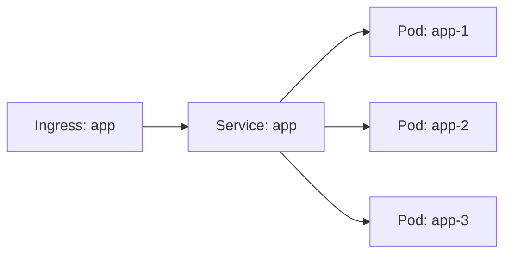

# Advanced Kubernetes Features Documentation

## Overview

Advanced Kubernetes features that bridge the gap between VS Code and JetBrains IDEs.

## Planned Features

### CRD Schema Validation

#### Dynamic Schema Loading
- Fetch CRD schemas from active cluster
- Cache schemas for performance
- Auto-update when CRDs change

#### Real-time Validation
```yaml
apiVersion: example.com/v1
kind: CustomResource
metadata:
  name: my-resource
spec:
  # ← Auto-completion based on CRD schema
  # ← Validation against CRD spec
  requiredField: value
```

#### Features
- Validate custom resources against CRD specs
- Show validation errors inline
- Auto-completion for CRD fields
- Hover documentation from CRD descriptions

### Deep Autocompletion

#### Context-Aware Completion
- Intelligent YAML path completion
- Kubernetes API schema integration
- Enum value suggestions
- Required field indicators

#### Examples
```yaml
apiVersion: apps/v1
kind: Deployment
spec:
  replicas: 3
  strategy:
    type: |  # ← Suggests: RollingUpdate, Recreate
```

### Resource Diagrams

#### Visualization Types
- **Deployment Relationships** - Pod → ReplicaSet → Deployment
- **Service Mapping** - Service → Endpoints → Pods
- **Ingress Routing** - Ingress → Service → Pods
- **Network Policies** - Policy → Pod selectors

#### Diagram Features
- Interactive diagrams (click to navigate)
- Mermaid.js or D2 rendering
- Export as image
- Real-time updates from cluster

#### Example Diagram


### Advanced Log Streaming

#### Multi-Pod Aggregation
- Stream logs from multiple pods simultaneously
- Merge and interleave logs
- Color-code by pod
- Timestamp synchronization

#### Filtering and Search
- Pattern matching (regex support)
- Log level filtering (INFO, WARN, ERROR)
- Exclude patterns
- Highlight matches

#### Features
- **Live streaming** - Real-time log updates
- **Historical logs** - View past logs
- **Export** - Save logs to file
- **Follow mode** - Auto-scroll with new logs

### Context and Namespace Switching

#### Quick Switcher
- Status bar integration
- Keyboard shortcut
- Recent contexts history
- Namespace favorites

#### Features
- **Fast switching** - One-click context change
- **Favorites** - Pin frequently used namespaces
- **History** - Recently used contexts
- **Validation** - Check cluster connectivity

## Configuration

### Settings

```json
{
  "extendedK8s.kubernetes.crdValidation": true,
  "extendedK8s.kubernetes.deepCompletion": true,
  "extendedK8s.kubernetes.diagrams.enabled": true,
  "extendedK8s.kubernetes.diagrams.renderer": "mermaid",
  "extendedK8s.kubernetes.logs.colorize": true,
  "extendedK8s.kubernetes.logs.maxLines": 1000
}
```

## Commands

- **Kubernetes: Validate Against CRD** - Validate custom resource
- **Kubernetes: Generate Diagram** - Create resource diagram
- **Kubernetes: Stream Logs** - Multi-pod log streaming
- **Kubernetes: Switch Context** - Quick context switcher
- **Kubernetes: Switch Namespace** - Quick namespace switcher

## Integration with Existing Tools

### VS Code Kubernetes Extension
- Complements existing Kubernetes extension
- Adds advanced features not available
- Works alongside without conflicts

### kubectl Integration
- Uses local kubeconfig
- Respects current context
- Compatible with kubectl plugins

## Status: Planned

These features are planned for future implementation. Current status: **Not yet implemented**.

## Implementation Priority

1. **Phase 1**: Context/namespace switching
2. **Phase 2**: CRD validation
3. **Phase 3**: Deep autocompletion
4. **Phase 4**: Log streaming enhancements
5. **Phase 5**: Resource diagrams
