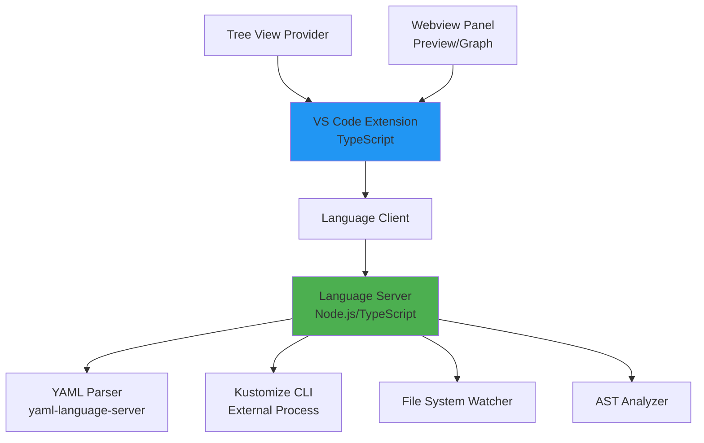
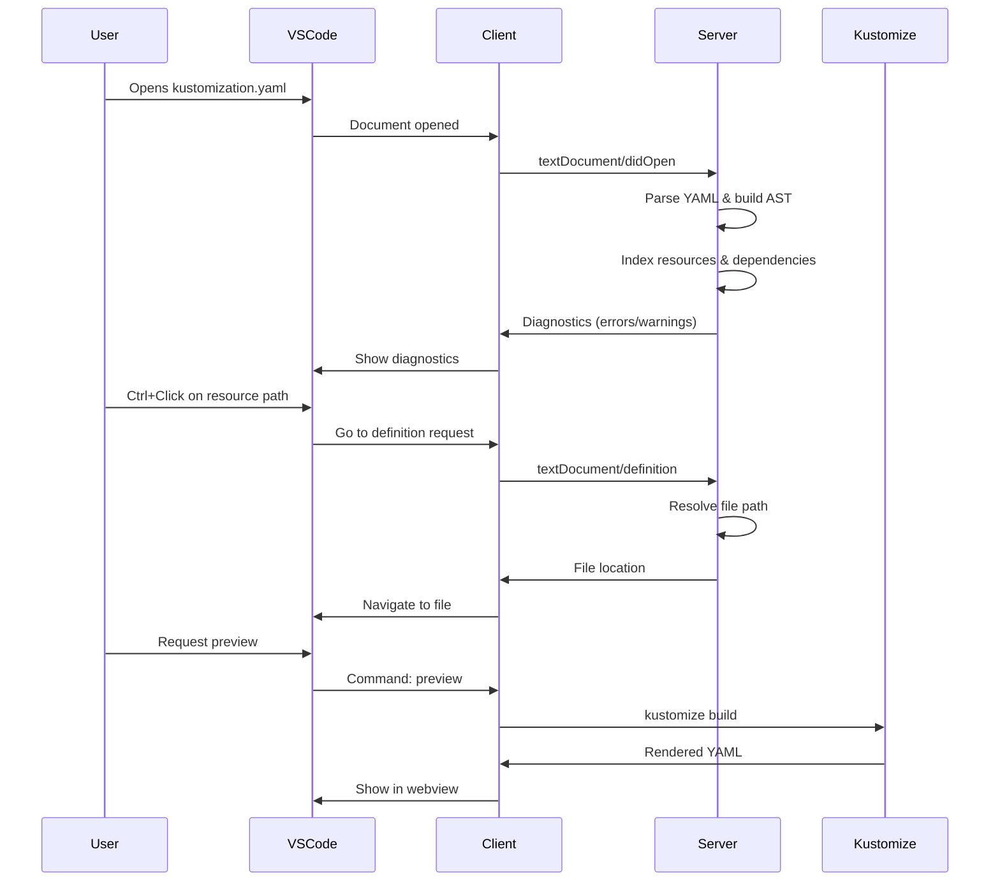

# Kustomize VS Code Extension - Design Plan

## Executive Summary

**Is it possible?** Yes, absolutely! Building a comprehensive Kustomize extension for VS Code is very achievable.

**Is it difficult?** Moderate difficulty. The core concepts are straightforward, but implementing advanced features like intelligent navigation and validation requires:
- Understanding VS Code extension APIs
- Working with Language Server Protocol (LSP)
- YAML parsing and AST manipulation
- File system watching and indexing

**Can we do it?** Definitely! We can build this together, starting with core features and iterating.

---

## Problem Statement

The current VS Code ecosystem lacks comprehensive Kustomize support compared to JetBrains IDEs. While the **Kustomize Navigator** extension exists, it has limitations, and the general **Kubernetes Tools** extension provides only basic YAML support without Kustomize-specific intelligence.

### Key Pain Points
1. **No intelligent navigation** to directories referenced in `resources`, `bases`, or `components`
2. **Limited IntelliSense** for Kustomize-specific fields and file paths
3. **No visualization** of the Kustomize overlay hierarchy
4. **Missing validation** for broken references and common misconfigurations
5. **No preview** of the final rendered YAML without running `kustomize build`
6. **Limited refactoring support** when moving or renaming files

---

## Feature Comparison: JetBrains vs VS Code

### JetBrains Kubernetes Plugin Features

| Feature | JetBrains | VS Code (Current) | Our Extension |
|---------|-----------|-------------------|---------------|
| **Navigation** |
| Ctrl+Click to jump to resource files | ✅ | ⚠️ Limited | ✅ Enhanced |
| Jump to base/overlay directories | ✅ | ❌ | ✅ |
| Navigate between patches and targets | ✅ | ⚠️ Basic | ✅ |
| Show back-references (what uses this?) | ✅ | ⚠️ Hover only | ✅ |
| **IntelliSense** |
| File path completion | ✅ | ❌ | ✅ |
| Field name completion | ✅ | ⚠️ Generic YAML | ✅ Kustomize-specific |
| Quick documentation | ✅ | ❌ | ✅ |
| **Validation** |
| Broken file references | ✅ | ❌ | ✅ |
| Invalid patch targets | ✅ | ❌ | ✅ |
| Circular dependencies | ❌ | ❌ | ✅ |
| **Visualization** |
| Overlay hierarchy tree | ❌ | ❌ | ✅ **NEW** |
| Resource dependency graph | ❌ | ❌ | ✅ **NEW** |
| **Preview** |
| Live rendered YAML preview | ❌ | ❌ | ✅ **NEW** |
| Diff view (base vs overlay) | ❌ | ❌ | ✅ **NEW** |
| **Refactoring** |
| Rename file updates references | ✅ | ❌ | ✅ |
| Move file updates paths | ✅ | ❌ | ✅ |
| **Other** |
| Flux CD variable support | ❌ | ✅ | ✅ |
| Multi-root workspace support | ✅ | ⚠️ Limited | ✅ |

**Legend:** ✅ Full support | ⚠️ Partial/Limited | ❌ Not available

---

## Proposed Feature Set

### Phase 1: Core Navigation & IntelliSense (MVP)

#### 1.1 Smart Navigation
- **Ctrl+Click (Go to Definition)** on:
  - `resources` entries → Jump to file or directory
  - `bases` entries → Jump to base directory's `kustomization.yaml`
  - `components` entries → Jump to component directory
  - `patches` entries → Jump to patch file
  - `configMapGenerator.files` → Jump to file
  - `secretGenerator.files` → Jump to file
  
- **Find All References** (Shift+F12):
  - Show all kustomization files that reference the current file
  - Show all patches that target the current resource

- **Breadcrumb Navigation**:
  - Show overlay hierarchy in VS Code breadcrumbs
  - Quick navigation between base → overlay → overlay

#### 1.2 IntelliSense & Auto-completion
- **Path Completion**:
  - Auto-complete file paths in `resources`, `bases`, `components`
  - Show only valid YAML files for resources
  - Show only directories with `kustomization.yaml` for bases
  
- **Field Completion**:
  - Kustomize-specific field suggestions (e.g., `patchesStrategicMerge`, `patchesJson6902`)
  - Context-aware suggestions based on Kustomize version
  
- **Snippet Library**:
  - Common Kustomize patterns (e.g., image transformer, namespace transformer)
  - Patch templates (strategic merge, JSON patch)

#### 1.3 Validation & Diagnostics
- **Real-time Error Detection**:
  - Broken file references (file doesn't exist)
  - Invalid directory references (no `kustomization.yaml` found)
  - Circular base dependencies
  - Duplicate resource names
  - Invalid patch syntax
  
- **Warnings**:
  - Deprecated fields (e.g., `patchesStrategicMerge` in Kustomize v5+)
  - Missing recommended fields (e.g., `namespace`)
  - Unused patches or resources

### Phase 2: Visualization & Preview

#### 2.1 Kustomize Explorer (Tree View)
- **Hierarchy View**:
  - Visual tree showing base → overlays → components
  - Expandable nodes showing resources in each layer
  - Icons indicating resource types (Deployment, Service, etc.)
  
- **Quick Actions**:
  - Right-click to build/preview
  - Jump to file from tree
  - Show effective configuration

#### 2.2 Live Preview Panel
- **Rendered YAML Preview**:
  - Side-by-side view: source vs rendered
  - Automatically runs `kustomize build` on save
  - Syntax highlighting for rendered output
  
- **Diff View**:
  - Show what changed from base to overlay
  - Highlight additions, deletions, modifications
  - Filter by resource type

#### 2.3 Dependency Graph
- **Visual Graph**:
  - Mermaid or D3.js diagram showing:
    - Base dependencies
    - Patch relationships
    - Resource references
  - Interactive: click to navigate

### Phase 3: Advanced Features

#### 3.1 Refactoring Support
- **Rename File**:
  - Automatically update all `kustomization.yaml` files that reference it
  
- **Move File**:
  - Update relative paths in all referencing files
  
- **Extract to Component**:
  - Select resources and extract to a reusable component

#### 3.2 Code Actions (Quick Fixes)
- **Fix Broken Reference**:
  - Suggest similar files if reference is broken
  - Create missing file/directory
  
- **Convert Patch Format**:
  - Convert between strategic merge and JSON patch
  
- **Add Missing Fields**:
  - Quick fix to add `namespace`, `commonLabels`, etc.

#### 3.3 Testing & Validation
- **Kustomize Build Integration**:
  - Run `kustomize build` from command palette
  - Show output in terminal
  - Parse errors and show as diagnostics
  
- **Kubernetes Validation**:
  - Validate rendered YAML against Kubernetes schemas
  - Check for deprecated API versions

#### 3.4 Flux CD Integration
- **Variable Substitution**:
  - Syntax highlighting for `${VAR}` placeholders
  - Validation against Flux variable sources
  - Preview with variable substitution
  - ConfigMap/Secret variable source tracking
  - Hover information showing variable values

- **Resource Management**:
  - Tree view for Flux resources (GitRepositories, HelmRepositories, HelmReleases, Kustomizations, Buckets)
  - Resource status indicators (Ready, Reconciling, Failed)
  - Context menu actions (Reconcile, Suspend, Resume)
  - Real-time reconciliation timeline view

- **Image Automation** (NEW):
  - ImageRepository and ImagePolicy visualization
  - Automated update tracking
  - Integration with container registries
  - Policy management UI

#### 3.5 ArgoCD Integration (NEW)
- **Application Management**:
  - Multi-instance support (connect to multiple ArgoCD servers)
  - Tree view for applications grouped by Projects/Clusters/Namespaces
  - Health and sync status indicators
  - Quick actions (Sync, Refresh, Delete, Hard Refresh)
  - SSO and token-based authentication

- **Application Details**:
  - Detailed application view with resource tree visualization
  - Live sync status and health monitoring
  - Deployment history and rollback capabilities
  - Diff view between Git and live state

- **Template Management**:
  - Application template library
  - Create applications from templates
  - Convert existing apps to templates
  - Built-in templates for Helm, Kustomize, Directory apps

- **YAML Integration**:
  - CodeLens for ArgoCD Application/ApplicationSet YAML files
  - Inline actions: "Create Application", "Sync", "Validate"
  - Status indicators in editor

---

## Technical Architecture

### Technology Stack



### Core Components

#### 1. Language Server (LSP)
- **Why LSP?** 
  - Separates language analysis from UI
  - Can be reused for other editors (Vim, Emacs, etc.)
  - Better performance (runs in separate process)

- **Responsibilities**:
  - Parse `kustomization.yaml` files
  - Build file index and dependency graph
  - Provide hover information, completion, diagnostics
  - Handle go-to-definition and find-references requests

#### 2. VS Code Extension (Client)
- **Responsibilities**:
  - Register language server
  - Provide tree view UI
  - Manage webview panels (preview, graph)
  - Handle commands and code actions
  - File system operations (rename, move)

#### 3. YAML Parser & AST
- Use existing `yaml-language-server` as base
- Extend with Kustomize-specific schema
- Build Abstract Syntax Tree for analysis

#### 4. Kustomize CLI Integration
- Shell out to `kustomize build` for preview
- Parse output and errors
- Cache results for performance

### Data Flow



---

## Implementation Roadmap

### Milestone 1: Project Setup & Basic Navigation (Week 1-2)
- [ ] Set up VS Code extension project structure
- [ ] Configure Language Server Protocol
- [ ] Implement YAML parsing for `kustomization.yaml`
- [ ] Basic go-to-definition for `resources` field
- [ ] File path validation (broken references)

### Milestone 2: IntelliSense & Validation (Week 3-4)
- [ ] Path auto-completion for all fields
- [ ] Kustomize field schema and completion
- [ ] Comprehensive validation rules
- [ ] Hover information with documentation
- [ ] Find all references implementation

### Milestone 3: Tree View & Explorer (Week 5-6)
- [ ] Build dependency graph from kustomization files
- [ ] Implement tree view provider
- [ ] Show hierarchy: bases → overlays
- [ ] Quick actions in tree view
- [ ] Multi-root workspace support

### Milestone 4: Preview & Visualization (Week 7-8)
- [ ] Integrate `kustomize build` CLI
- [ ] Webview panel for rendered YAML
- [ ] Diff view (base vs overlay)
- [ ] Syntax highlighting in preview
- [ ] Error handling and caching

### Milestone 5: Refactoring & Code Actions (Week 9-10)
- [ ] Rename file refactoring
- [ ] Move file refactoring
- [ ] Quick fixes for common issues
- [ ] Code actions menu
- [ ] Extract to component

### Milestone 6: Advanced Features (Week 11-12)
- [ ] Dependency graph visualization
- [ ] Flux CD variable support
- [ ] Kubernetes schema validation
- [ ] Performance optimization
- [ ] Testing and documentation

---

## Development Complexity Assessment

### Easy Parts ✅
- Basic file navigation (Ctrl+Click)
- File path validation
- YAML syntax highlighting
- Tree view UI

### Moderate Parts ⚠️
- Language Server Protocol setup
- YAML AST parsing and analysis
- Auto-completion logic
- Dependency graph building

### Challenging Parts 🔴
- Handling complex patch scenarios (strategic merge vs JSON patch)
- Circular dependency detection
- Refactoring with path updates
- Performance with large monorepos
- Flux CD variable substitution edge cases

---

## Technical Challenges & Solutions

### Challenge 1: Relative Path Resolution
**Problem:** Kustomize uses relative paths, which can be complex in multi-root workspaces.

**Solution:**
- Build a virtual file system index
- Resolve paths relative to each `kustomization.yaml` location
- Cache resolved paths for performance

### Challenge 2: Performance with Large Repos
**Problem:** Scanning thousands of YAML files can be slow.

**Solution:**
- Incremental indexing (only re-scan changed files)
- Use file system watchers for real-time updates
- Lazy loading for tree view
- Debounce validation and diagnostics

### Challenge 3: Kustomize CLI Dependency
**Problem:** Users need `kustomize` CLI installed for preview.

**Solution:**
- Check for CLI availability on activation
- Provide helpful error messages with install instructions
- Consider bundling a specific version (optional)
- Fallback to basic features if CLI not available

### Challenge 4: YAML Parsing Edge Cases
**Problem:** YAML has complex syntax (anchors, aliases, multi-line strings).

**Solution:**
- Use battle-tested `yaml` npm package
- Handle parse errors gracefully
- Provide partial IntelliSense even with syntax errors

---

## Extension Configuration

```jsonc
{
  "kustomize.enabled": true,
  "kustomize.kustomizePath": "kustomize", // Path to kustomize CLI
  "kustomize.autoPreview": false, // Auto-build on save
  "kustomize.validation.enabled": true,
  "kustomize.validation.checkCircularDeps": true,
  "kustomize.completion.autoImportPaths": true,
  "kustomize.treeView.showResources": true,
  "kustomize.treeView.groupByType": false,
  "kustomize.flux.enabled": true, // Enable Flux CD features
  "kustomize.flux.variableFiles": ["vars.yaml"] // Variable source files
}
```

---

## Success Metrics

### User Experience
- ✅ Navigate to any referenced file/directory in < 2 clicks
- ✅ Auto-completion reduces typing by 50%+
- ✅ Catch 90%+ of broken references before commit
- ✅ Preview rendered YAML in < 1 second

### Technical
- ✅ Extension activates in < 500ms
- ✅ IntelliSense suggestions appear in < 100ms
- ✅ Support repos with 1000+ kustomization files
- ✅ < 100MB memory footprint

---

## Competitive Advantages Over JetBrains

| Feature | Why Better |
|---------|------------|
| **Live Preview** | JetBrains doesn't have built-in preview |
| **Dependency Graph** | Visual representation not available in JetBrains |
| **Flux CD Integration** | First-class support for GitOps workflows |
| **Open Source** | Community-driven, free for all |
| **Cross-Platform** | Works in VS Code, Codespaces, vscode.dev |
| **Extensible** | Can integrate with other K8s tools |

---

## Next Steps

### Immediate Actions
1. **Set up development environment**
   - Install VS Code Extension Generator (`yo code`)
   - Create project structure
   - Set up TypeScript and LSP dependencies

2. **Build MVP (Milestone 1)**
   - Focus on core navigation first
   - Get basic Ctrl+Click working
   - Validate with real Kustomize projects

3. **Gather Feedback**
   - Share with Kubernetes community
   - Iterate based on user needs
   - Prioritize most-requested features

### Questions for You
1. **Scope:** Should we start with MVP (Milestone 1-2) or go for full feature set?
2. **Timeline:** How much time can you dedicate per week?
3. **Experience:** Have you built VS Code extensions before?
4. **Use Case:** What's your primary Kustomize workflow we should optimize for?

---

## Resources

### Documentation
- [VS Code Extension API](https://code.visualstudio.com/api)
- [Language Server Protocol](https://microsoft.github.io/language-server-protocol/)
- [Kustomize Documentation](https://kubectl.docs.kubernetes.io/references/kustomize/)
- [YAML Language Server](https://github.com/redhat-developer/yaml-language-server)

### Example Extensions
- [Kustomize Navigator](https://marketplace.visualstudio.com/items?itemName=weaveworks.vscode-kustomize-navigator)
- [Kubernetes Tools](https://marketplace.visualstudio.com/items?itemName=ms-kubernetes-tools.vscode-kubernetes-tools)
- [YAML Extension](https://marketplace.visualstudio.com/items?itemName=redhat.vscode-yaml)

### Tools
- [Yeoman VS Code Generator](https://github.com/Microsoft/vscode-generator-code)
- [vscode-languageserver-node](https://github.com/microsoft/vscode-languageserver-node)

---

## Conclusion

Building a comprehensive Kustomize extension for VS Code is **definitely achievable** and would fill a significant gap in the ecosystem. The project has:

- **Clear value proposition:** Features that don't exist in current VS Code extensions
- **Moderate complexity:** Challenging but not overwhelming
- **Strong foundation:** Can leverage existing LSP and YAML tooling
- **Community need:** Many developers want better Kustomize support

**My recommendation:** Start with Milestone 1-2 (MVP with navigation and IntelliSense), get it working well, publish to marketplace, and iterate based on user feedback. This approach minimizes risk and gets value to users quickly.

Let's build this! 🚀
